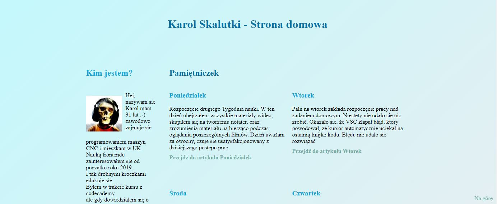

# Strona ta powstaje w trakcie nauki na kursie **WTF: Co Ten Frontend?**

## Do zbudowania tego projektu wykorzystywane są :
- ***HTML 5***
- ***CSS 3***
- ***Javascript ES6***
- ***Git***
- ***BEM***
- ***Sass***
- ***Gulp***

[Przejdź](https://karolskalinski.github.io/homepage-gulp/) do strony.

## wtf-gulp-starter

`npm install -g gulp-cli`

`npm install`

`gulp`

To publish your page using github pages use `npm run deploy`
